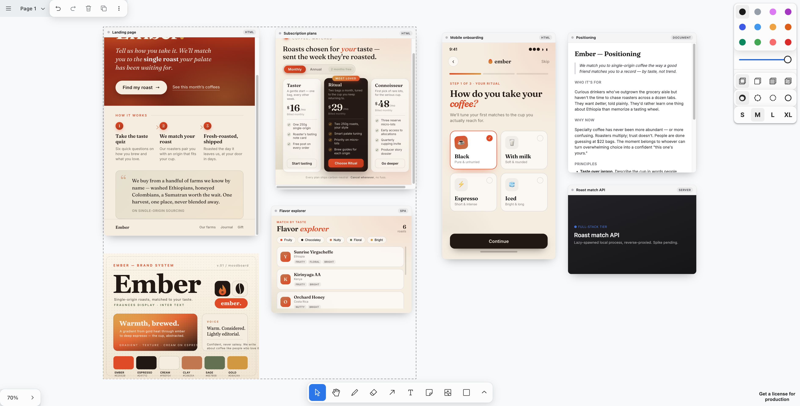

# Exploration Canvas

**An infinite canvas for AI-driven exploration.** Point it at a project and a coding
agent (Claude) fills a zoomable, rearrangeable board with *live* artifacts — HTML
pages, React SPAs, markdown documents, reference images — each one a real file on
disk. The file tree is the source of truth; the canvas (built on [tldraw](https://tldraw.dev))
is a live projection over it.



## Install (as a Claude skill)

```bash
npx skills@latest add Fawwaz-2009/exploration-canvas
```

This installs the skill (`SKILL.md` + the `reference/` tool). From then on, Claude
knows how to spin up a canvas in any project and explore on it.

## Why

Exploring an idea means trying many things from many angles — UI directions,
clickable prototypes, integration spikes, brand/narrative, pricing writeups,
moodboards — and *seeing them together*. Design tools (Figma, etc.) make the AI
round-trip a heavyweight scene graph through its context window. This flips it:
the AI does what it's great at — **writing files** — and those files render as
tiles. Cheap context, and HTML as the universal medium.

## How it works

- **One artifact = one folder** under `artifacts/<id>/` with its content + a tiny
  `frame.json` (position/size/kind). `canvas.json` holds groups, edges, viewport.
- **Files ⇄ canvas, both ways.** A local dev server serves each artifact on one
  origin and watches the files. Edit a file (or scaffold one) → the tile appears/
  updates live. Drag a tile → its `frame.json` updates on disk. No database, no
  manual sync.
- **Tiles are live and interactive.** Double-click a tile to use the real page
  (click, scroll, fill forms); click away to go back to arranging.
- **tldraw gives the rest for free** — grouping, sticky notes, text, arrows, draw,
  resize, undo, native images.

## The design principle: code vs. instructions

The skill is split along one line:

- **Code (deterministic)** → the `reference/canvas/` app + the `canvas` CLI.
  Rendering, serving, file-sync, manifest CRUD, non-overlapping placement, the
  responsive boilerplate. One correct answer, every time.
- **Instructions (judgment)** → `SKILL.md`. *What* to explore, *which* medium,
  the actual content, and *how* to arrange it.

The agent never hand-edits `canvas.json`/`frame.json` — it calls `canvas <verb>`,
so the mechanical parts can't go wrong.

## Quick start (run the demo)

```bash
cd reference/canvas
npm install
npm run dev        # http://localhost:5173
```
Ships with a sample "Ember" exploration board. Then try the CLI:

```bash
node bin/canvas.mjs list
node bin/canvas.mjs scaffold my-idea --tier html --title "My idea"   # tile appears live
node bin/canvas.mjs rm my-idea
```

## The `canvas` CLI

| Command | Does |
|---|---|
| `scaffold <id> --tier html\|spa\|document [--title] [--near <id>]` | create an artifact (folder + responsive skeleton + register it) |
| `place <id> --xy X,Y \| --near <id>` | move a tile |
| `fork <id> --as <newId>` | branch a direction to remix |
| `link <from> <to> --label "..."` | draw a relationship arrow |
| `rm <id>` | remove an artifact |
| `list` | list artifacts and positions |

## Repo layout

```
exploration-canvas/
├── SKILL.md                 # the skill: judgment-only instructions for the agent
├── README.md
├── docs/                    # founding design doc + screenshot
└── reference/
    └── canvas/              # the deterministic tool — copy into a project as .canvas/
        ├── bin/canvas.mjs   # the CLI
        ├── src/             # the tldraw canvas + custom artifact shape
        ├── server/          # the single-origin host + file-watcher (Vite plugin)
        ├── artifacts/       # the demo's artifact folders (your project's live here)
        └── canvas.json      # the layout manifest
```

## Status

Working: the file-synced canvas, the live tiers (html / spa / document / image),
interaction + scroll, native grouping, the CLI. Not yet built: the full-stack
("server") tier (lazy-spawned process behind a reverse proxy — see
`docs/founding-design.md` §8), and a polished empty/new-project bootstrap.

Built with Claude Code.
